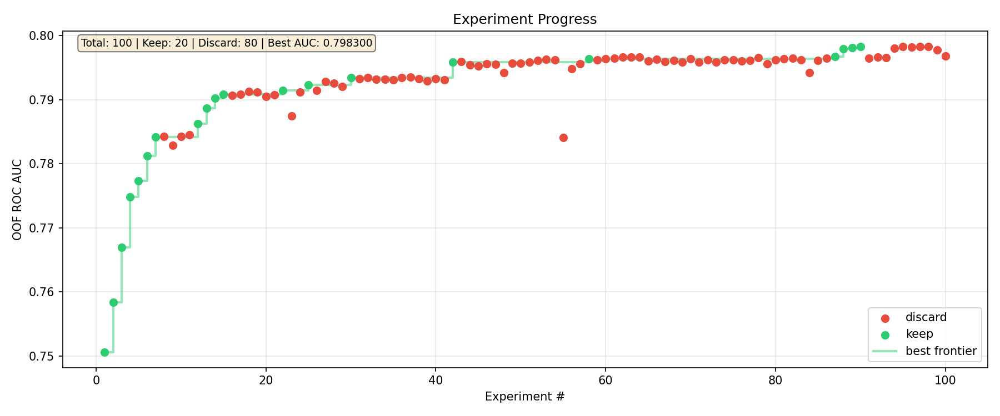

# Auto ML Experiment — LLM-Driven Credit Risk Modeling

An autonomous ML experiment where an LLM agent iteratively improves a credit risk prediction pipeline without human intervention. Inspired by [karpathy/autoresearch](https://github.com/karpathy/autoresearch).

## How It Works

1. The LLM agent reads `program.md` — its instruction protocol
2. It modifies `train.py` with an experiment idea
3. `prepare.py` evaluates the pipeline using fixed 5-fold Stratified CV (seed=42)
4. If OOF ROC AUC improves, the commit is kept; otherwise it's reverted
5. The agent logs results to `results.csv` and code snippets to `notes.md`
6. Loop continues autonomously until interrupted

## Project Structure

```
.
├── program.md              # Agent instruction protocol (read-only)
├── prepare.py              # Fixed evaluation harness (read-only)
├── train.py                # ML pipeline — the only file the agent modifies
├── competition_overview.md # Competition rules and data description
├── agent-race-data/        # Raw data files (read-only)
│   ├── train.parquet
│   ├── test.csv
│   ├── columns_description.csv
│   ├── table_map.md
│   └── *.parquet           # Auxiliary tables
├── features/               # Cached engineered features (.csv)
├── .devcontainer/          # Dev container configuration
│   ├── devcontainer.json
│   └── Dockerfile
├── analysis.py             # Generate progress chart from results.csv
├── results.csv             # Experiment results log (generated)
├── notes.md                # Experiment notes with code snippets (generated)
└── submissions/            # All submission files (generated)
    └── submission_latest.csv
```

## Getting Started

### Prerequisites

- Python 3.11+
- [Claude Code](https://claude.ai/claude-code) CLI
- (Optional) [Codex CLI](https://github.com/openai/codex) — for additional brainstorming

### Option A: Dev Container (recommended)

1. Open the project in VS Code
2. Reopen in Container (`.devcontainer/` handles setup)
3. Set your `ANTHROPIC_API_KEY`
4. Recommended: use `--dangerously-skip-permissions` since the agent runs in an isolated container
   ```bash
   claude --dangerously-skip-permissions "Read program.md and begin the experiment loop."
   ```

### Option B: Local Setup

- Python 3.11+
- The agent will install any required packages during the experiment

### Run the Experiment

```bash
claude "Read program.md and begin the experiment loop."
```

The agent will:
- Create a git branch
- Initialize `results.csv` and `notes.md`
- Run the baseline, then iterate autonomously

### Monitor Progress

```bash
# Watch the results log
cat results.csv

# Check the current best AUC
grep "keep" results.csv

# Review experiment notes
cat notes.md
```

### Remote Monitoring

Use Claude Code's [Remote Control](https://docs.anthropic.com/en/docs/claude-code) to monitor the agent from any browser or the Claude mobile app.

**Option 1: Start with remote control enabled**
```bash
claude --remote-control "Auto ML Experiment"
```

**Option 2: Start a dedicated remote control server**
```bash
claude remote-control --name "Auto ML Experiment" --verbose
```

**Option 3: Enable mid-session**
```
/remote-control
```

Once enabled, connect via:
- Open the session URL in any browser
- Scan the QR code with the Claude mobile app
- Find the session on [claude.ai/code](https://claude.ai/code)

## Experiment Progress



The chart shows each experiment's OOF AUC score over time. Green dots are kept improvements, red dots are discarded experiments, and the step line tracks the best AUC frontier.

Generate the chart:
```bash
python analysis.py
```

## Key Design Decisions

| Decision | Rationale |
|----------|-----------|
| Fixed CV in `prepare.py` | Scores are comparable across experiments |
| `notes.md` persists across git resets | Discarded ideas can be revisited and combined |
| Feature caching in `features/` | Avoids recomputing expensive aggregations |
| OOF AUC as primary metric | More reliable than public leaderboard for model selection |

## Data

The dataset is a credit risk prediction task. Binary classification to predict `target_event_flag` (payment stress). See `competition_overview.md` for full details.
